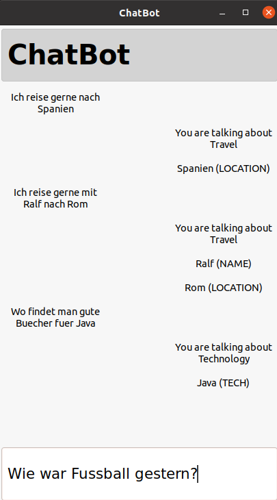

# GermanChatBot
### A chatbot for german language

In this project, I have implemented a chatbot in which the topics of 
the user input is identified. For now, it is only working for German
language because of the training data. So, with the suitable training
data, it will work for any other languages. Also, since the standard 
C++ string class only supports ascii characters, the german sentences
should be entered by english format which means ä, ö, ü, and ß should
be replaced with ae, oe, ue, ss.

There are different approaches toward the recognition as follows,
1. Search in a list of known important German words
2. Sentence classification based on Fasttext library
2. Removing the stopwords

There is a simple training set under data/train.csv that users can replace
it with whatver they need to.

## An example of chat

## Dependencies for Running Locally
* cmake >= 3.7
  * All OSes: [click here for installation instructions](https://cmake.org/install/)
* make >= 4.1 (Linux, Mac), 3.81 (Windows)
  * Linux: make is installed by default on most Linux distros
  * Mac: [install Xcode command line tools to get make](https://developer.apple.com/xcode/features/)
  * Windows: [Click here for installation instructions](http://gnuwin32.sourceforge.net/packages/make.htm)
* gcc/g++ >= 5.4
  * Linux: gcc / g++ is installed by default on most Linux distros
  * Mac: same deal as make - [install Xcode command line tools](https://developer.apple.com/xcode/features/)
  * Windows: recommend using [MinGW](http://www.mingw.org/)

- A version of [fasttext library](https://github.com/facebookresearch/fastText) is already copied inside the source directory.
So there is no need for installation. 

## Basic Build Instructions

1. git clone https://github.com/rostam/GermanChatBot
2. Make a build directory in the top level directory: `mkdir build && cd build`
3. Compile: `cmake .. && make`
4. Run it: `./GermanChatBot`.
